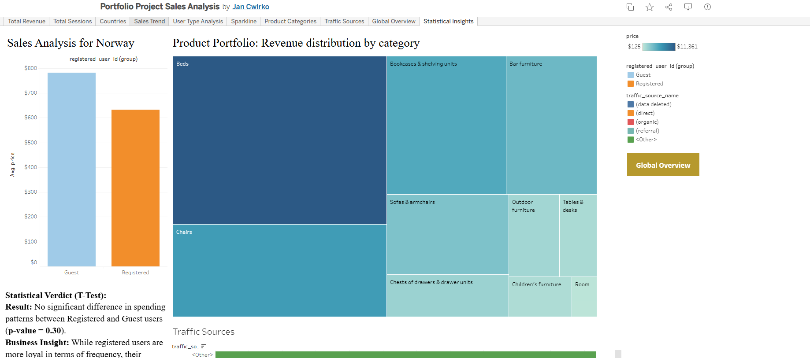

# E-commerce Business Performance Analysis

## Project Overview
A comprehensive study of e-commerce health, analyzing traffic sources and geographic regions' contribution to revenue.

## Workflow & Features
* **ETL Process:** Extracted data from Google BigQuery and processed it using Python (Pandas/Seaborn).
* **Interactive Dashboard:** [View Audit on Tableau Public](https://public.tableau.com/app/profile/jan.cwirko/viz/PortfolioProjectSalesAnalysis/StatisticalInsights)
* **Note:** Use the **"Global Sales Dynamics"** and **"User Analysis"** tabs to explore the business audit.
* **Visual Preview:**

## Technical Skills
* **Advanced Tableau:** Implementing Action Filters (click a country on the map to navigate to detailed user analysis).
* **Python Insights:** Deep dive into acquisition channels, identifying Organic and Direct as top performers.
