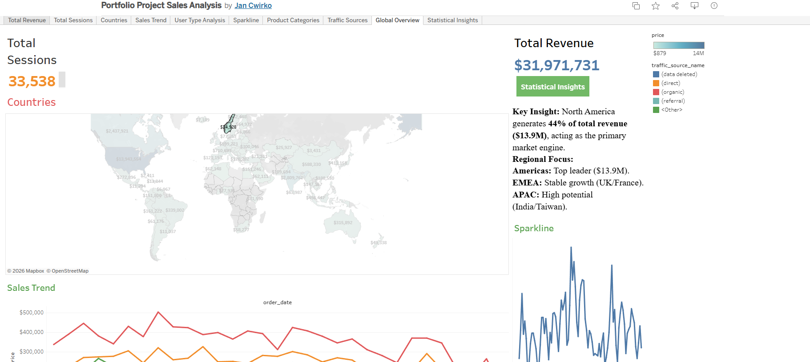

# E-commerce Business Performance Analysis

## Project Overview
A comprehensive study of e-commerce health, analyzing traffic sources and geographic regions' contribution to revenue. This project demonstrates advanced data integration between BigQuery, Python, and Tableau.

## Workflow & Features
* **ETL Process:** Extracted data from Google BigQuery and processed it using Python (Pandas/Seaborn).
* **Interactive Dashboard:** [View Audit on Tableau Public](https://public.tableau.com/app/profile/jan.cwirko/viz/PortfolioProjectSalesAnalysis/StatisticalInsights)
* **Visual Previews:**
  * **Global Sales Dynamics:**
    
  * **User & Product Analysis:**
    

## Technical Skills
* **Advanced Tableau:** Implementing Action Filters (click a country on the map to navigate to detailed user analysis).
* **User Segmentation:** Deep dive into acquisition channels, identifying Organic and Direct as top performers.
* **Navigation:** Built a multi-tab system for seamless switching between high-level and granular data views.
